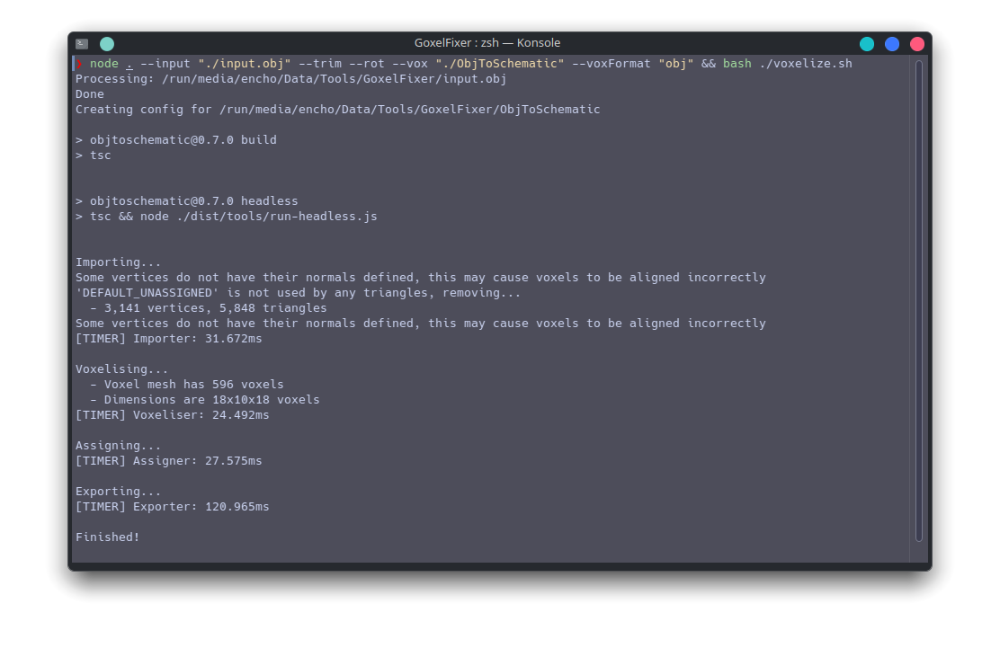

 <div align="center">
	<h1>Goxel Fixer</h1>
	<p>Tweak Goxel's .obj exports and feed them into ObjToSchematic for a 1:1 Goxel-to-Minecraft workflow!</p>
	<h4>
		<a href="https://github.com/Enchoseon/GoxelFixer/issues">Report Bug</a>
	</h4>
	
	
	
	
</div>

<br />

# Table of Contents

- [Introduction](#introduction)
- [Command Line Options](#command-line-options)
- [Examples](#examples)
- [Images](#images)

# Introduction

Goxel is an open-source voxel editor that exports non-standard OBJs with vertex color information crammed into the vertex information. This practice is widespread (e.g. Pixelogic's Zbrush), but has scattershot support.

This small cli tool takes Goxel's .obj exports and modifies them to use the standard Material Template Format (.mtl). The modifications applied are primarily geared for use with ObjToSchematic for a 1:1 conversion to Minecraft blocks.

# Command Line Options

```
--version                            Show version number         [boolean]
--inputFile, --input                 The path to the .obj file exported by
                                    Goxel that we want to process.
                                                        [string] [required]
--outputPath, --output               The path to the directory the fixed
                                    .obj and .mtl files will be placed.
                                                [string] [default: "./"]
--trimUselessData, --trim            Whether to remove data that's useless
                                    for ObjToSchematic (e.g. vertex
                                    normals, texture coordinates, etc.)
                                                                [boolean]
--rotationFix, --rot                 Whether to rotate the object -90
                                    degrees along the x-axis to fix
                                    Goxel's exporting.          [boolean]
--objToSchematicPath, --vox          Path to ObjToSchematic (e.g.
                                    `./ObjToSchematic`). If provided,
                                    will overwrite the headless-config.ts
                                    (e.g. `./ObjToSchematic/tools/headles
                                    s-config.ts`) and create a Bash
                                    script to execute it in
                                    `./voxelize.sh`.             [string]
--objToSchematicFormat, --voxFormat  What type of file to create (valid
                                    options: 'litematic', 'obj',
                                    'schematic')
                                            [string] [default: "litematic"]
-h, --help                               Show help                   [boolean]
```

# Examples

- `node . --input "./goxelExport.obj" --trim --rot`
    - Generate a trimmed and rotated .obj file in the root directory from an .obj file in the root directory.
- ` node . --input "./goxelExport.obj" --trim --rot --vox "./ObjToSchematic"`
    - Same as previous example, but update the headless-config.ts file in an instance of ObjToSchematic in the root folder.
- ` node . --input "./goxelExport.obj" --trim --rot --vox "./ObjToSchematic" --voxFormat "litematic" && bash ./voxelize.sh`
    - Same as previous example, but immediately run ObjToSchematic headlessly for a .litematic file.

# Images

<em>Note: Please pardon the lack of images, working on getting some demo files!</em>

<div align="center">
  <br>
  <!-- <br> -->
</div>